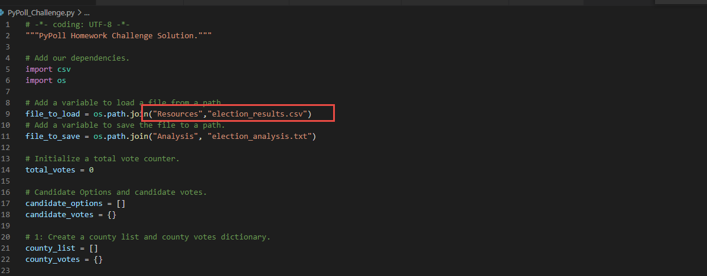
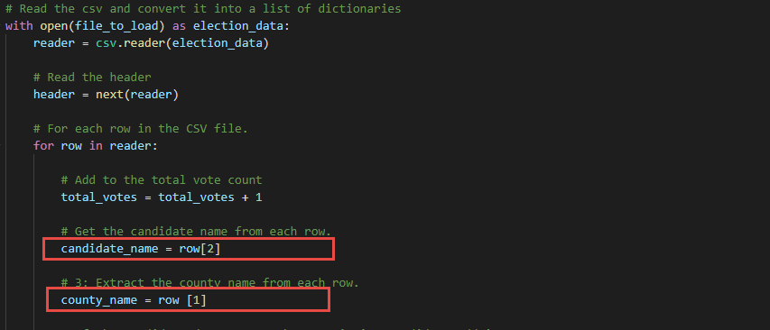

# Election_Analysis

## Overview of Election Analysis
The election analysis audits congressional election results in Jefferson, Denver, and Arapahoe for candidates Charles Casper Stockham, Diana DeGette and Raymon Anthony Doane.

## Election-Audit Results

**There are total 369,711 votes**

**Votes details in each County**
- Jefferson has 38,855 votes with 10.5% of total votes.
- Denver has 306,055 votes with 82.8% of total votes.
- Arapahoe has 24,801 votes with 6.7% of total votes.

**Largest County**
- Denver is the largest County with 306,055 votes, and 82.8T of total votes.

**Votes details of Candidates**
- Charles Casper Stockham gets 23.0% of total votes with 85,213 votes
- Diana DeGette wins gets 73.8% of total votes with 272,892 votes
- Raymon Anthony Doane gets 3.1% of total votes with 11,606 votes

**Winner of the election**
- Diana DeGette wins the election with 272,892 votes which is 73.8% of total votes.

## Election-Audit Summary

Python is implemented in this analysis process to efficiently and accurately pull the election results. This Python code is reusable with simple modification in any election analysis as the examples below:

**Change file Path to another election file**

**Define Variables with the new file structure columns**

